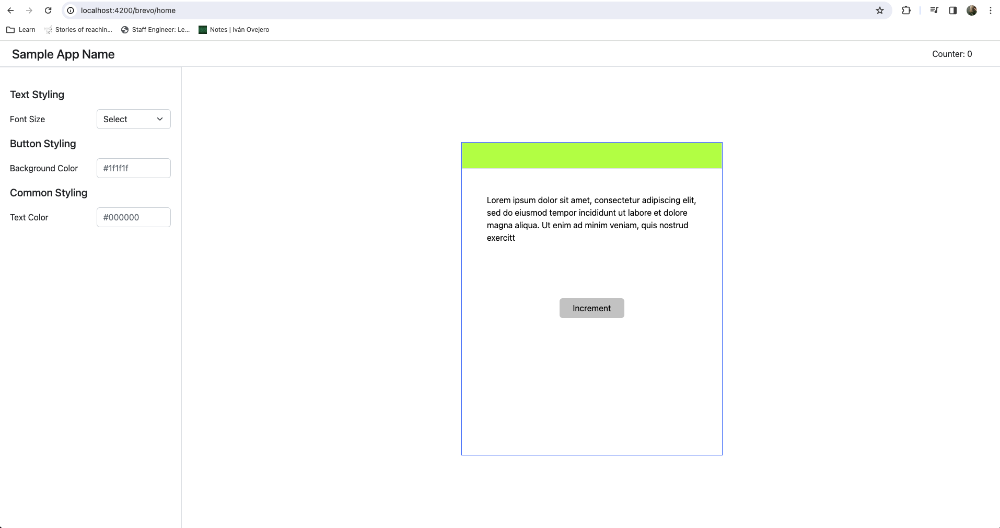
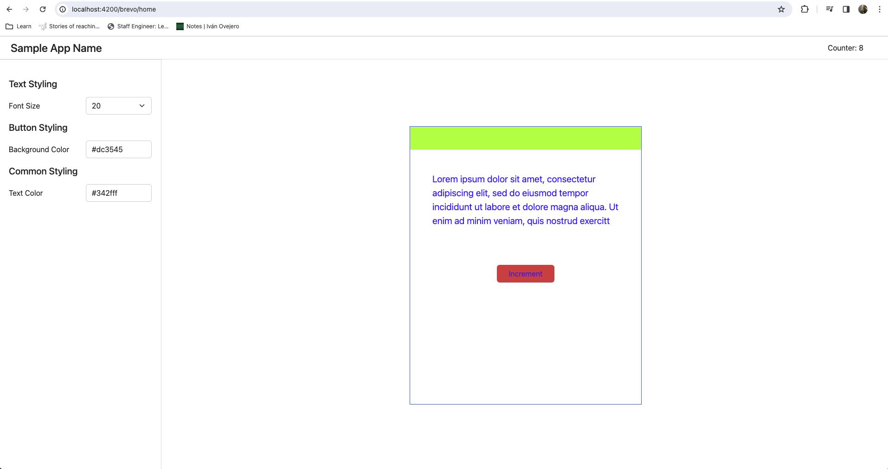
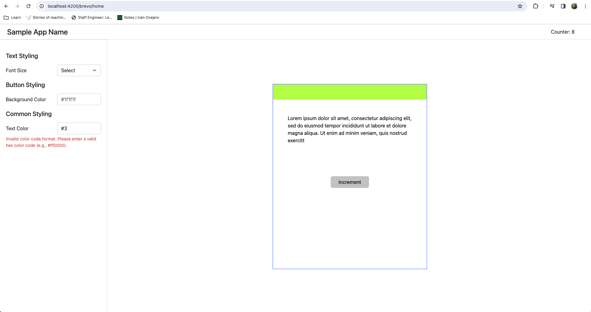
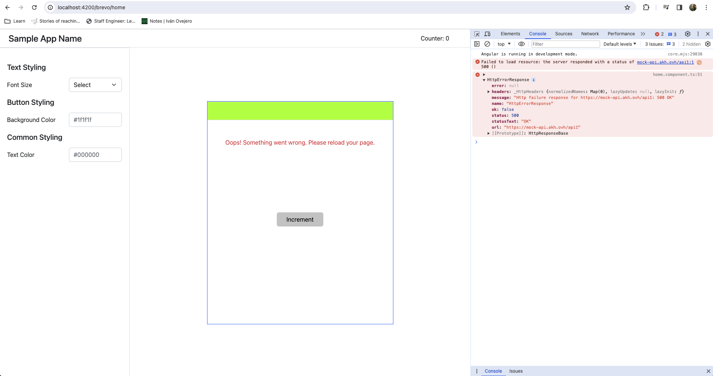

# Brevo Assignment (Angular 17)

## Table of Contents

- [Setup and Start application](#setup)
- [Screenshots](#screenshots)
- [Technical Choices](#technical-choices)
- [Assumptions](#assumptions)
- [ToDo's](#todos)

## Setup & Start App

1. Navigate to the project root and install dependencies using:

```bash
  npm install
```

2. Run the application on development server using:

```bash
  npm run start
```

3. Open your web browser and navigate to `http://localhost:4200/` to view the application.
   Please note that you will be redirected to `http://localhost:4200/brevo/home` automatically.

## Screenshots


_Initial state of the app when navigated to `http://localhost:4200/brevo/home`_


_App state where all events are in action_


_App state where input field 'Text Color' points out invalid color code entry by user_


_App state where error message is displayed due to API failure and logged into console_

## Technical Choices

1. **CSS Framework**: Bootstrap framework
2. **Latest Angular Features**: Standalone components, Signals, Dependency injection using inject() are used in this application
3. **Testing**: Jest, as Karma test runner is deprecated
4. **Code Style**: Prettier

## Assumptions

1. Font Size select does not require validation as user will select pre-defined values.
2. In Font Size select input field, upon selecting 'select' option, font-size is set to default font-size ie. 16px
3. Invalid background-color and text-color input in the respective input fields will reset to default color ie. #000000
4. On API failure, error message from server might be too technical for the user. So it is not printed in the main layout, but can be viewed in console
5. All input fields are considered to be individual components and not part of a single form.

## ToDo's

1. Tests are incomplete
2. 404 page when user is on unknown route
